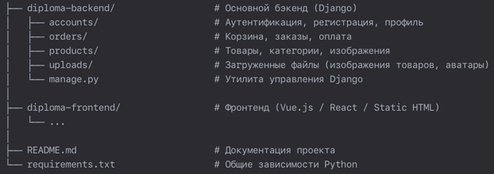

# Итоговый проект - интернет-магазин "Megano"

Проект представляет собой подключаемое **Django-приложение** (**backend**) интернет-магазина "Megano" и является полнофункциональным аналогом интернет-магазинов типа: holodilnik.ru, citilink.ru или ozon.ru. 
Он реализован на **фреймворке Django** с помощью _Django REST Framework_. Интегрирован с готовым подключаемым **Django-приложением** (**frontend**)

## Проект включает: 
- создание REST API, 
- работу с пользователями, 
- работу с корзиной, 
- работу с заказами, 
- работу с оплатой,
- работу с административной панелью.
 
## Структура проекта

## Процесс разворачивания проекта:
1. Клонируйте репозиторий: `git clone https://gitlab.skillbox.ru/samira_kurkova/python_django_diploma`
2. Перейдите в папку с проектом: `cd diploma-backend`
3. Создайте виртуальное окружение: `python -m venv venv`
4. Активируйте виртуальное окружение: `source venv/bin/activate`
5. Установите зависимости: `pip install -r requirements.txt`
6. Настройте переменные окружения: 
   - переименуйте файл `.env.template` → `.env`
   - отредактируйте файл `.env`
7. Выполните миграции: `python manage.py migrate`
8. Загрузите фикстуры данных: `python manage.py loaddata users categories product_images reviews sales specifications tags products`
9. Запустите сервер: `python manage.py runserver 0.0.0.0:8000`
10. Документация API доступна по адресу: `http://127.0.0.1:8000/api/schema/`

## Административная панель
Админка доступна по адресу: `http://127.0.0.1:8000/admin/`

В ней можно:
- Управлять пользователями
- Управлять товарами и категориями
- Просматривать заказы
- Настроить параметры доставки

## API предоставляет следующие эндпоинты:
* ### Auth - операции с пользователями
  - `POST` `/api/sign-up`: Регистрация пользователя
  - `POST` `/api/sign-in`: Авторизация пользователя
  - `POST` `/api/sign-out`: Выход авторизированного пользователя

* ### Profile - операции с профилем пользователя
  - `GET` `/api/profile`: Получить профиль пользователя
  - `POST` `/api/profile`: Обновить данные профиля пользователя
  - `POST` `/profile/password`: Обновить пароль профиля пользователя
  - `POST` `/profile/avatar`: Обновить фото профиля пользователя

* ### Product - операции с товаром
  - `GET` `/product/{id}`: Получить товар
  - `POST` `/product/{id}/review`: Добавить отзыв на товар

* ### Products - операции с товарами
  - `GET` `/products/popular`: Получить популярные товары
  - `GET` `/products/limited`: Получить лимитированные товары

* ### Catalog - каталог товаров
  - `GET` `/catalog`: Получить каталог товаров

* ### Categories - категории товаров
  - `GET` `/categories`: Получить категории товаров

* ### Sales - скидка на товары
  - `GET` `/sales`: Получить товары со скидкой

* ### Banners - товары для баннера
  - `GET` `/banners`: Получить товары для баннера

* ### Tags - теги товаров
  - `GET` `/tags`: Получить теги товаров

* ### Basket - операции с корзиной
  - `GET` `/api/basket`: Получить корзину
  - `POST` `/api/basket`: Добавить товар в корзину
  - `DELETE` `/api/basket`: Удалить товар из корзины

* ### Order - операции с заказом
  - `GET` `/api/order/{id}`: Получить заказ 
  - `POST` `/api/order/{id}`: Подтвердить заказ

* ### Orders - операции с заказами
  - `GET` `/api/orders`: Получить список активных заказов пользователя
  - `POST` `/api/orders`: Создать заказ пользователем
  
* ### Payment - оплата заказа
  - `POST` `/api/payment/{id}`: Оплата заказа

### Примечание: 
**Frontend** поставляется как сторонняя библиотека. Инструкция по работе с ним лежит в папке `/diploma-frontend`.